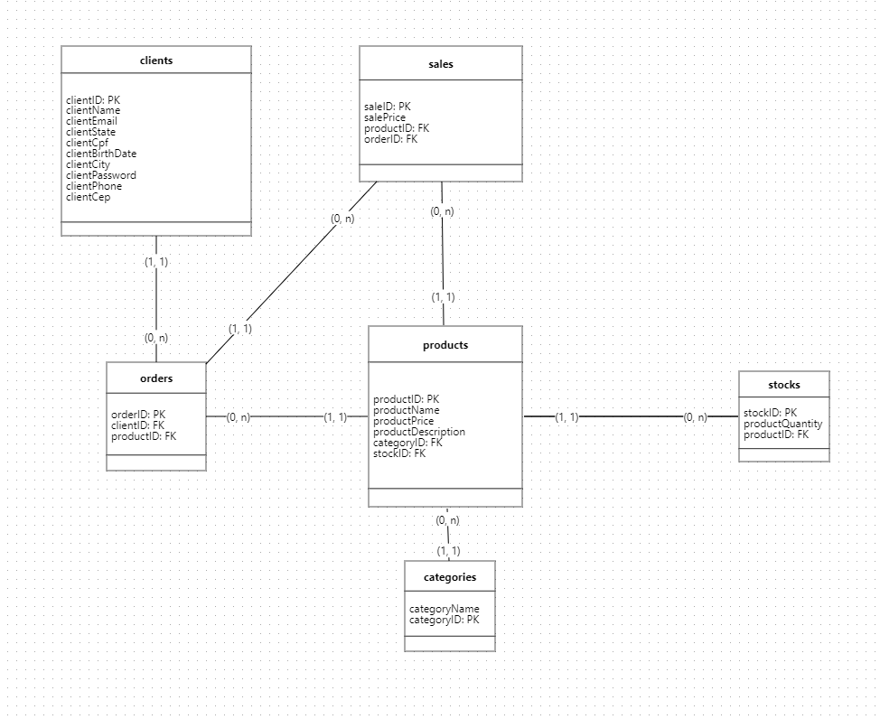

# Desafio 6 - Escola DNC

### Integração e modelagem de dados de um produto digital

  
  
Modelagem do BD feito no modeloBR

## 💻 Tecnologias 
### Para criação e execução do projeto
- Nodejs
- MySQL (Docker image)
- Postman
- DBeaver

### Dependências 
- Express
- mysql2
- knex
- cors

